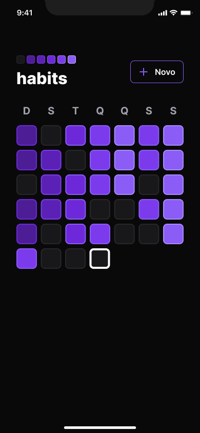

<h1 align="center">Habits Manager</h1>

  <a href="https://github.com/danielhuanca98/habits-manager-web">Web</a>&nbsp;&nbsp;&nbsp;|&nbsp;&nbsp;&nbsp;
  <a href="https://github.com/danielhuanca98/habits-manager-server">Server</a>&nbsp;&nbsp;&nbsp;|&nbsp;&nbsp;&nbsp;
  <a href="#">Mobile</a>&nbsp;&nbsp;&nbsp;|&nbsp;&nbsp;&nbsp;
  <a href="https://www.figma.com/file/7gcr5znHIaPz8JAoiyJo5f/Habits-(i)-(Community)-(Community)?node-id=6%3A343&t=YCRz5hgdnITX0zxk-0">Figma</a>

Este projeto foi desenvolvido durante o evento NLW Setup promovido pela <a href="https://github.com/rocketseat-education">🚀Rocketseat</a>

  
  
  

## :closed_book: Projeto

O Habits manager é uma aplicação que permite o registro hábitos, tarefas a serem completadas regularmente durante a semana, pelo usuário para um acompanhamento a longo prazo oferecendo sistema de notificações e uma interface visual simples e intuitiva.

## :pencil: Conceitos estudados

- Animações com react-native-reanimated
- Tratamento de datas com dayjs
- Navegação Stack com react-navigation

## 🚀 Desafios

Funcionalidades em desenvolvimento:

- Autenticação com Google Firebase
- Push Notifications com Expo

## 🛠️ Ferramentas utilizadas

- [React Native](https://github.com/facebook/react-native)
- [Typescript](https://github.com/microsoft/TypeScript)
- [Expo](https://github.com/expo/expo)
- [NativeWind](https://github.com/marklawlor/nativewind)
- [Axios](https://github.com/axios/axios)
